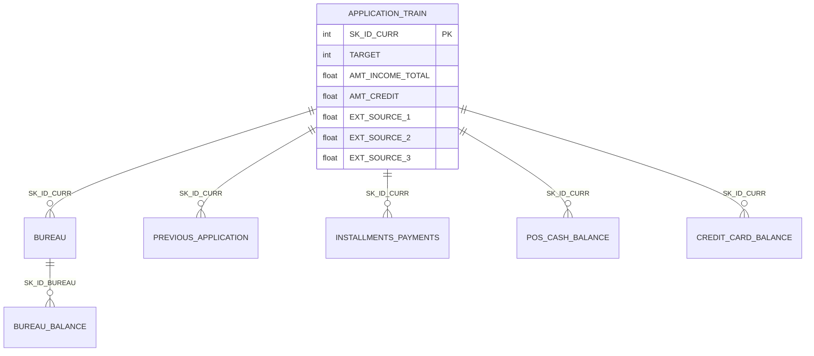
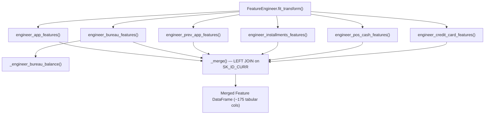
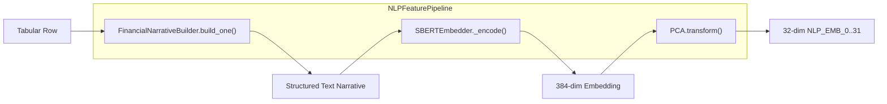
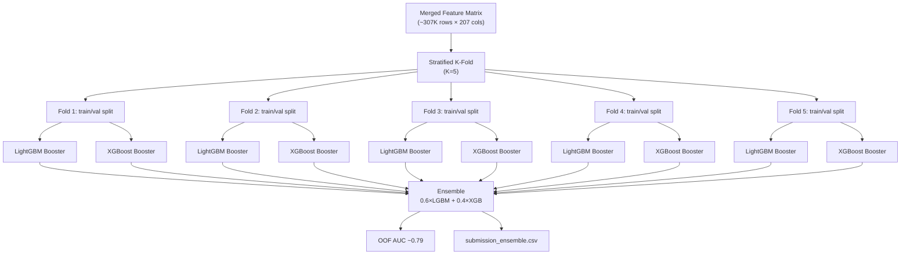
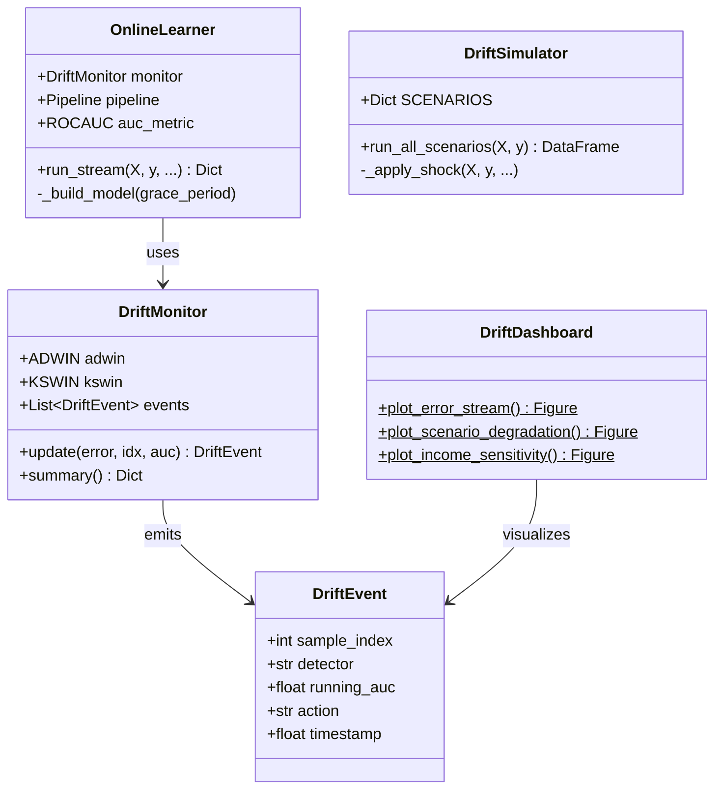
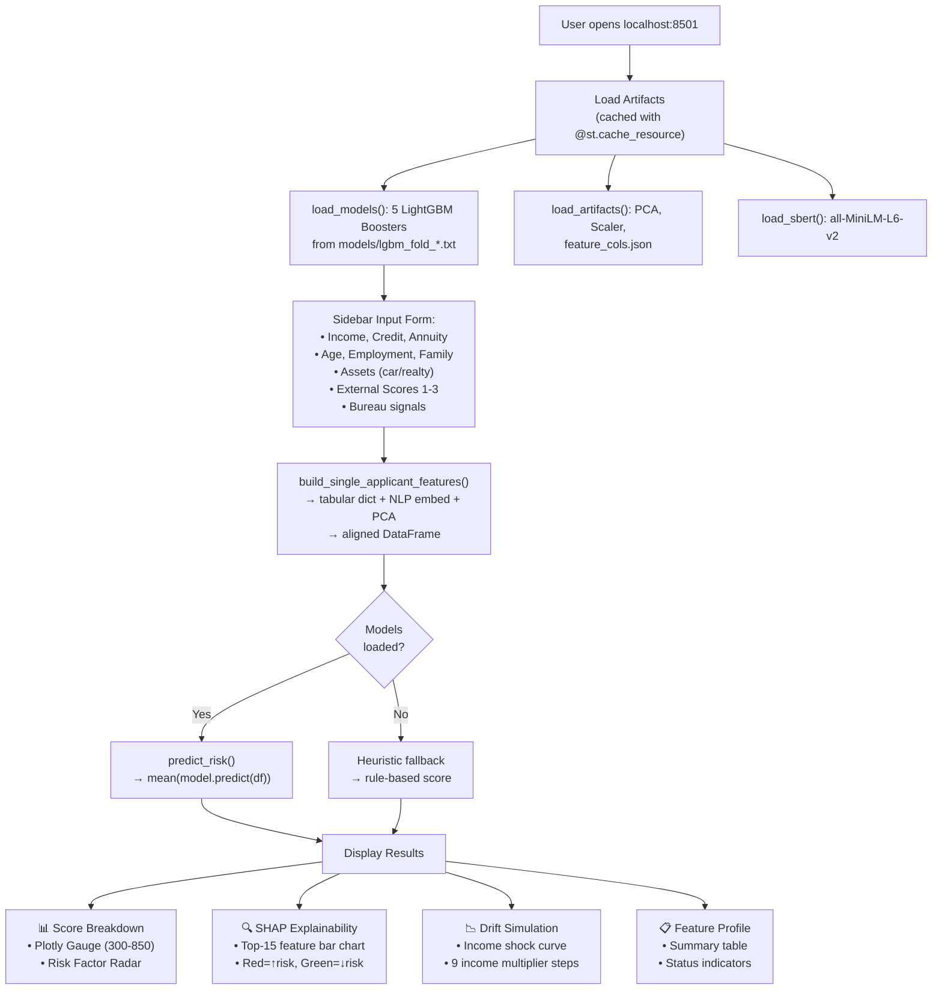
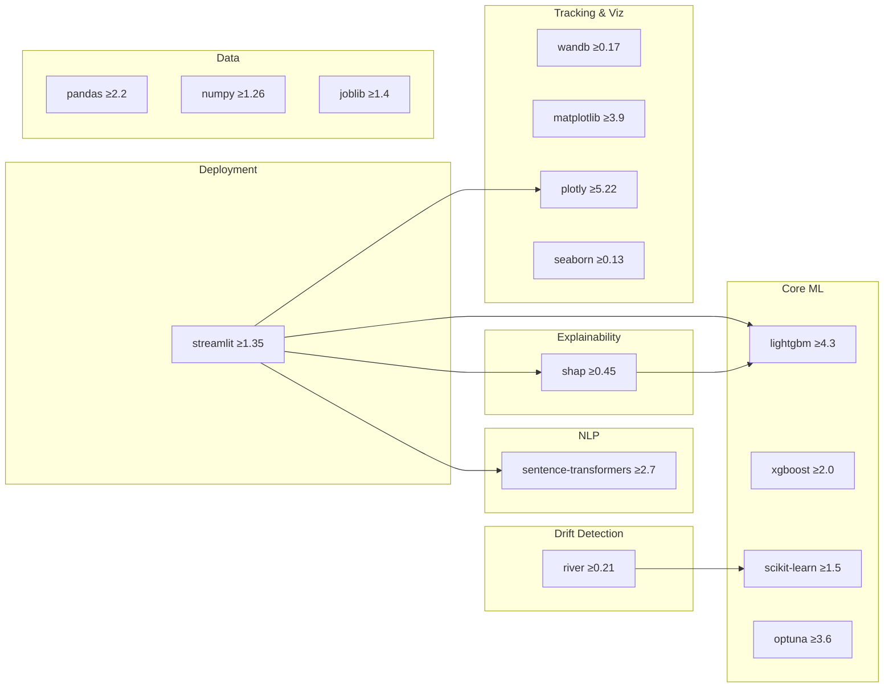

<p align="center">
  <h1 align="center">Architecture — Credit Invisibility Solver</h1>
  <p align="center"><b>Complete system design & code walkthrough</b></p>
</p>

---

## Table of Contents

- [High-Level Overview](#high-level-overview)
- [System Architecture Diagram](#system-architecture-diagram)
- [Repository Structure](#repository-structure)
- [Data Layer](#data-layer)
- [Feature Engineering Pipeline](#feature-engineering-pipeline)
- [NLP Embedding Pipeline](#nlp-embedding-pipeline)
- [Model Training & Ensemble](#model-training--ensemble)
- [Explainability Layer (SHAP)](#explainability-layer-shap)
- [Concept Drift Detection](#concept-drift-detection)
- [Streamlit Application](#streamlit-application)
- [Serialized Artifacts](#serialized-artifacts)
- [Dependency Map](#dependency-map)
- [Data Flow Summary](#data-flow-summary)

---

## High-Level Overview

This system is an **end-to-end ML pipeline** for credit risk scoring, specifically designed to serve the 1.7 billion credit-invisible population who lack formal bureau history. It combines:

| Capability | Implementation |
|---|---|
| **Feature Engineering** | 200+ features from 7 relational tables |
| **NLP Signals** | Sentence-BERT embeddings of synthesized financial narratives |
| **Gradient Boosting Ensemble** | LightGBM + XGBoost with Optuna HPO |
| **Explainability** | SHAP TreeExplainer (bar, beeswarm, waterfall, dependence) |
| **Concept Drift Detection** | River ADWIN/KSWIN + online Hoeffding Adaptive Tree |
| **Experiment Tracking** | Weights & Biases |
| **Deployment** | Interactive Streamlit dashboard |

---

## System Architecture Diagram

```
┌──────────────────────────────────────────────────────────────────────────────┐
│                        HOME CREDIT DATASET (Kaggle)                         │
│   application_train/test │ bureau │ bureau_balance │ previous_application   │
│   installments_payments  │ POS_CASH_balance │ credit_card_balance          │
└──────────────────────────────────┬───────────────────────────────────────────┘
                                   │
               ┌───────────────────┼───────────────────┐
               ▼                                       ▼
  ┌─────────────────────────┐            ┌──────────────────────────┐
  │  FEATURE ENGINEERING    │            │  NLP EMBEDDING PIPELINE  │
  │  src/feature_engineering│            │  src/nlp_features.py     │
  │  .py                    │            │                          │
  │                         │            │  FinancialNarrativeBuilder│
  │  • engineer_app_features│            │  ──▶ Synthesize text per │
  │  • engineer_bureau_     │            │      applicant row       │
  │    features             │            │                          │
  │  • engineer_prev_app_   │            │  SBERTEmbedder           │
  │    features             │            │  ──▶ all-MiniLM-L6-v2    │
  │  • engineer_installments│            │  ──▶ 384-dim → PCA → 32 │
  │    _features            │            │                          │
  │  • engineer_pos_cash_   │            │  NLPFeaturePipeline      │
  │    features             │            │  ──▶ fit_transform /     │
  │  • engineer_credit_card_│            │      transform           │
  │    features             │            └────────────┬─────────────┘
  │                         │                         │
  │  FeatureEngineer class  │                         │
  │  ──▶ fit_transform()    │                         │
  └──────────┬──────────────┘                         │
             │                                        │
             └──────────────┬─────────────────────────┘
                            ▼
             ┌──────────────────────────┐
             │  MERGED FEATURE MATRIX   │
             │  ~207 columns            │
             │  (175 tabular + 32 NLP)  │
             └──────────┬───────────────┘
                        │
          ┌─────────────┼──────────────┐
          ▼                            ▼
┌────────────────────┐    ┌────────────────────────┐
│  OPTUNA HPO        │    │  5-FOLD STRATIFIED CV  │
│  80 trials each    │    │                        │
│  TPE sampler       │    │  LightGBM (5 models)   │
│  MedianPruner      │    │  XGBoost  (5 models)   │
└────────┬───────────┘    └──────────┬─────────────┘
         └────────────┬──────────────┘
                      ▼
        ┌────────────────────────────────┐
        │  WEIGHTED ENSEMBLE             │
        │  0.6 × LightGBM + 0.4 × XGB   │
        │  (± Logistic Regression blend) │
        └──────────┬─────────────────────┘
                   │
     ┌─────────────┼──────────────────────┐
     ▼             ▼                      ▼
┌──────────┐ ┌──────────────┐  ┌────────────────────────┐
│  SHAP    │ │  W&B Logging │  │  DRIFT DETECTION       │
│  Tree-   │ │  Per-fold    │  │  src/drift_detector.py  │
│  Explain │ │  AUC, feat   │  │                        │
│  er      │ │  importance  │  │  DriftMonitor (ADWIN   │
│          │ │              │  │  + KSWIN)              │
│  • bar   │ │              │  │  OnlineLearner (HATR)  │
│  • bee-  │ │              │  │  DriftSimulator        │
│    swarm │ │              │  │  DriftDashboard        │
│  • water │ │              │  │                        │
│    fall  │ │              │  │  Batch shock scenarios  │
│  • dep.  │ │              │  │  + real-time stream    │
│    plots │ │              │  │    monitoring           │
└──────────┘ └──────────────┘  └────────────────────────┘
                   │
                   ▼
        ┌────────────────────────┐
        │  STREAMLIT DASHBOARD   │
        │  app.py                │
        │                        │
        │  • Sidebar applicant   │
        │    input form          │
        │  • Gauge + radar chart │
        │  • SHAP bar chart      │
        │  • Drift sensitivity   │
        │    curve               │
        │  • Feature profile     │
        │    summary table       │
        └────────────────────────┘
```

---

## Repository Structure

```
Explainable-Credit-Risk-Modeling-with-Schduling/
│
├── app.py                        ← Streamlit dashboard (431 lines)
│                                    Entry point: `streamlit run app.py`
│
├── explainable-credit-risk-      ← Kaggle training notebook
│   modeling-with-schduling.ipynb    Full pipeline: EDA → FE → NLP → Train
│                                    → SHAP → Drift → Submission
│
├── src/                          ← Core ML modules
│   ├── feature_engineering.py    ← 387 lines — 7-table feature pipeline
│   ├── nlp_features.py          ← 372 lines — SBERT + PCA pipeline
│   └── drift_detector.py        ← 482 lines — River drift detection
│
├── models/                       ← Serialized model artifacts
│   ├── lgbm_fold_{1-5}.txt      ← 5 LightGBM Booster models
│   ├── xgb_fold_{1-5}.json      ← 5 XGBoost Booster models
│   ├── pca.pkl                  ← Fitted PCA (32 components)
│   ├── scaler.pkl               ← Fitted StandardScaler
│   └── feature_cols.json        ← 207 ordered feature names
│
├── kaggle_output/                ← Notebook output artifacts
│   ├── eda_overview.png         ← EDA composite plot
│   ├── shap_bar.png             ← Global SHAP importance
│   ├── shap_beeswarm.png        ← Per-feature dot plot
│   ├── shap_dependence.png      ← Top-3 feature dependence
│   ├── shap_waterfall.png       ← Single-applicant waterfall
│   ├── drift_simulation.png     ← Batch shock scenarios
│   ├── river_drift_detection.png← Online ADWIN stream
│   ├── submission_ensemble.csv  ← Kaggle submission file
│   └── wandb/                   ← W&B run logs
│
├── utils/                        ← Dashboard screenshots
│   ├── 1.jpeg – 4.jpeg          ← Streamlit UI captures
│
├── requirements.txt              ← 18 Python dependencies
├── README.md                     ← Project overview & results
└── LICENSE                       ← MIT License
```

---

## Data Layer

### Source: Home Credit Default Risk (Kaggle)

The dataset comprises **7 relational tables** linked by `SK_ID_CURR` (applicant ID):



| Table | Rows | Key Signals |
|---|---|---|
| `application_train` | ~307K | Demographics, income, external scores, document flags |
| `application_test` | ~48K | Same schema without `TARGET` |
| `bureau` | ~1.7M | Past credit history from other institutions |
| `bureau_balance` | ~27M | Monthly balances for bureau credits |
| `previous_application` | ~1.7M | Previous Home Credit loan applications |
| `installments_payments` | ~13.6M | Payment history for previous credits |
| `POS_CASH_balance` | ~10M | Point-of-sale / cash loan monthly balances |
| `credit_card_balance` | ~3.8M | Credit card monthly snapshots |

**Target:** Binary `TARGET` — 1 = default, 0 = repaid (91.9% / 8.1% class imbalance).

---

## Feature Engineering Pipeline

**File:** [`src/feature_engineering.py`](src/feature_engineering.py) (387 lines)

### Architecture



### Module Breakdown

| Function | Source Table | Features Created | Key Engineered Signals |
|---|---|---|---|
| `engineer_app_features()` | `application` | ~50 | `CREDIT_INCOME_RATIO`, `EXT_SOURCE_MEAN/MIN/PROD/STD`, `AGE_YEARS`, `EMPLOYED_RATIO`, `DOCUMENT_COUNT`, `TOTAL_ENQUIRIES`, `SOCIAL_CIRCLE_DEF_RATE` |
| `engineer_bureau_features()` | `bureau` + `bureau_balance` | ~30 | `BUREAU_DEBT_CREDIT_RATIO_MEAN/MAX`, `BB_DPD_RATE`, `BB_SEVERE_DPD_RATE`, `BUREAU_COUNT`, `BUREAU_CREDIT_TYPE_DIVERSITY` |
| `engineer_prev_app_features()` | `previous_application` | ~22 | `PREV_APPROVED_RATE`, `PREV_REFUSED_RATE`, `PREV_APP_CREDIT_RATIO_MEAN`, `PREV_LAST_CREDIT` |
| `engineer_installments_features()` | `installments_payments` | ~16 | `INST_LATE_PAYMENT_RATE`, `INST_PAYMENT_DIFF_MEAN`, `INST_SHORT_PAYMENT_RATE`, `INST_OVER_PAYMENT_RATE` |
| `engineer_pos_cash_features()` | `POS_CASH_balance` | ~10 | `POS_DPD_RATE`, `POS_SEVERE_DPD_RATE`, `POS_SK_DPD_MAX` |
| `engineer_credit_card_features()` | `credit_card_balance` | ~15 | `CC_UTIL_RATE_MEAN/MAX`, `CC_DRAWING_RATE_MEAN`, `CC_DPD_MEAN` |

### Design Decisions

1. **All aggregations use `groupby(SK_ID_CURR)`** with `mean`, `max`, `sum`, `std` — standard credit risk patterns
2. **Derived ratios** (e.g., `DEBT_CREDIT_RATIO`, `PAYMENT_RATIO`) capture relative behaviour, not just absolutes
3. **Categorical encoding** via `LabelEncoder` on all `object` columns in the application table
4. **`FeatureEngineer` class** orchestrates the full pipeline with a single `fit_transform(tables, mode)` call

---

## NLP Embedding Pipeline

**File:** [`src/nlp_features.py`](src/nlp_features.py) (372 lines)

### Architecture



### Three-Class Design

| Class | Responsibility |
|---|---|
| `FinancialNarrativeBuilder` | Converts a tabular row into a structured English paragraph describing the applicant's financial profile. Uses template pools for financial literacy levels, employment status, and asset ownership. |
| `SBERTEmbedder` | Loads `all-MiniLM-L6-v2` (384-dim), encodes text batches, applies PCA dimensionality reduction (384 → 32), and handles model lifecycle (lazy load + cleanup via `gc.collect()`). |
| `NLPFeaturePipeline` | End-to-end orchestrator: calls `FinancialNarrativeBuilder.build_batch()` → `SBERTEmbedder.fit_transform()` / `.transform()`. Saves/loads PCA to disk. |

### Narrative Synthesis Example

```
"Applicant is 35 years old with a declared annual income of 250,000 currency units.
 Requesting a credit facility of 500,000 units, representing a credit-to-income
 ratio of 2.00x. Client shows moderate financial awareness with occasional delayed
 payments. Currently employed for 5.0 years; career trajectory appears stable.
 Applicant owns residential property, a strong collateral signal. No dependents;
 household size of 3. Bureau records show 4 historical credit lines, of which
 1 are currently active. Moderate enquiry activity (3 enquiries recorded).
 External creditworthiness assessments: bureau=0.60, behavioural=0.55,
 alternative=0.50 (composite=0.55)."
```

> **Production note:** In a real deployment, `FinancialNarrativeBuilder` would be replaced by actual user-generated text (financial literacy survey responses, app usage patterns, etc.). The synthesized narratives demonstrate the pipeline architecture.

---

## Model Training & Ensemble

**File:** Jupyter notebook `explainable-credit-risk-modeling-with-schduling.ipynb`

### Training Flow



### Hyperparameter Optimization (Optuna)

| Setting | Value |
|---|---|
| **Sampler** | TPE (Tree-Structured Parzen Estimator) |
| **Pruner** | MedianPruner (10 warmup steps) |
| **Trials** | 80 per model type |
| **Search Space** | `num_leaves`, `learning_rate`, `feature_fraction`, `bagging_fraction`, `reg_alpha`, `reg_lambda`, `max_depth`, `min_gain_to_split` |

### Ensemble Results

| Component | Strategy | OOF AUC |
|---|---|---|
| LightGBM | 5-fold CV, Optuna-tuned | ~0.78 |
| XGBoost | 5-fold CV, Optuna-tuned | ~0.77 |
| **Ensemble** | 0.6×LGBM + 0.4×XGB weighted blend | **~0.79** |

---

## Explainability Layer (SHAP)

### Integration Points

| Context | Implementation |
|---|---|
| **Notebook (training)** | Full SHAP suite: `TreeExplainer` on LightGBM → beeswarm, bar, waterfall, dependence plots saved to `kaggle_output/` |
| **Streamlit (inference)** | Per-applicant SHAP via `get_shap_values()` in `app.py` → top-15 feature horizontal bar chart |

### `get_shap_values()` — app.py

```python
def get_shap_values(model, df_feat, feature_cols):
    explainer = shap.TreeExplainer(model)
    sv = explainer.shap_values(df_feat)     # Per-feature contributions
    return sv, explainer.expected_value, df_feat
```

The function:
1. Creates a `TreeExplainer` from the first fold LightGBM model
2. Computes SHAP values for the single-applicant feature vector
3. Returns raw values + base rate for the Plotly bar chart

### Generated SHAP Artifacts

| Plot | File | Purpose |
|---|---|---|
| Global feature importance | `kaggle_output/shap_bar.png` | Mean absolute SHAP per feature |
| Beeswarm | `kaggle_output/shap_beeswarm.png` | Per-sample feature impact distribution |
| Dependence (top 3) | `kaggle_output/shap_dependence.png` | Non-linear feature relationships |
| Waterfall (highest risk) | `kaggle_output/shap_waterfall.png` | Single-applicant feature breakdown |

---

## Concept Drift Detection

**File:** [`src/drift_detector.py`](src/drift_detector.py) (482 lines)

### Four-Class Architecture



### Component Details

#### `DriftMonitor`
- Wraps **River ADWIN** (δ = 0.002) and **KSWIN** (α = 0.005, window = 100)
- On each prediction error: feeds both detectors → ADWIN gets priority → returns `DriftEvent` or `None`
- ADWIN detection → `action = "retrain"` | KSWIN detection → `action = "alert"`

#### `OnlineLearner`
- Inner model: `StandardScaler → HoeffdingAdaptiveTreeClassifier` (River pipeline)
- Streams data sample-by-sample via `river.stream.iter_pandas()`
- On drift: rebuilds pipeline with faster `grace_period` (200 → 50) for rapid adaptation
- Tracks running ROC-AUC across the entire stream
- Optional **synthetic drift injection**: modifies income by a multiplier + flips a fraction of labels at a specified sample index

#### `DriftSimulator`
- **Batch-mode** drift testing with 5 predefined economic shock scenarios:

| Scenario | Income Multiplier | Employment Mask | Label Noise |
|---|---|---|---|
| Baseline | 1.0× | 0% | 0% |
| Mild Income Shock −30% | 0.70× | 5% | 2% |
| Severe Income Shock −60% | 0.40× | 15% | 5% |
| Mass Job Loss 20% | 0.50× | 20% | 8% |
| Full Economic Collapse | 0.25× | 40% | 15% |

#### `DriftDashboard`
- Static methods generating Matplotlib / Plotly plots:
  - `plot_error_stream()`: smoothed prediction error with ADWIN/KSWIN drift markers
  - `plot_scenario_degradation()`: AUC bar chart across scenarios
  - `plot_income_sensitivity()`: AUC vs income fraction line chart

---

## Streamlit Application

**File:** [`app.py`](app.py) (431 lines)

### Application Flow



### Key Functions

| Function | Purpose |
|---|---|
| `load_models()` | Loads 5 LightGBM Boosters from disk (cached) |
| `load_artifacts()` | Loads PCA, StandardScaler, feature column list (cached) |
| `load_sbert()` | Loads Sentence-BERT model (cached) |
| `build_single_applicant_features()` | Converts sidebar inputs → text narrative → SBERT embed → PCA → merged tabular+NLP DataFrame |
| `predict_risk()` | Ensemble prediction: averages predictions across all fold models |
| `risk_band()` | Maps probability → LOW (<15%) / MEDIUM (<40%) / HIGH risk |
| `get_shap_values()` | Runs SHAP TreeExplainer on the first fold model |

### Demo Mode

When model files are missing, the app gracefully degrades:
- `predict_risk()` → replaced by heuristic: `0.9 - 0.4×ext_mean - 0.1×(emp/40) + 0.15×(credit/income)`
- SHAP tab → shows mock feature contributions
- NLP embeddings → fallback to zero vectors

---

## Serialized Artifacts

### `models/` Directory

| File | Format | Size | Description |
|---|---|---|---|
| `lgbm_fold_{1-5}.txt` | LightGBM text | ~10-12 MB each | 5 Booster models (one per CV fold) |
| `xgb_fold_{1-5}.json` | XGBoost JSON | ~4-5 MB each | 5 Booster models (one per CV fold) |
| `pca.pkl` | Joblib pickle | ~52 KB | Fitted `sklearn.decomposition.PCA` (32 components, maps 384-dim SBERT → 32-dim) |
| `scaler.pkl` | Joblib pickle | ~2 KB | Fitted `sklearn.preprocessing.StandardScaler` |
| `feature_cols.json` | JSON array | ~5 KB | Ordered list of 207 feature column names used by the trained models |

### `kaggle_output/` Directory

| File | Description |
|---|---|
| `eda_overview.png` | Composite EDA plot (target distribution, income, age, occupation) |
| `shap_bar.png` | Global SHAP mean absolute feature importance |
| `shap_beeswarm.png` | SHAP beeswarm summary plot |
| `shap_dependence.png` | Top-3 feature dependence plots |
| `shap_waterfall.png` | Highest-risk applicant waterfall |
| `drift_simulation.png` | Batch scenario AUC degradation |
| `river_drift_detection.png` | Online ADWIN error stream + cumulative detections |
| `submission_ensemble.csv` | Kaggle competition submission (SK_ID_CURR, TARGET) |
| `wandb/` | Weights & Biases run logs and metadata |

---

## Dependency Map



---

## Data Flow Summary

```
                    ┌─────────────────┐
                    │  7 Raw CSV/     │
                    │  Parquet Tables │
                    └────────┬────────┘
                             │
          ┌──────────────────┼──────────────────┐
          ▼                                     ▼
  ┌───────────────┐                   ┌──────────────────┐
  │ Feature Eng.  │                   │ Narrative + SBERT │
  │ 175 cols      │                   │ 32 NLP cols       │
  └───────┬───────┘                   └────────┬─────────┘
          │                                    │
          └──────────────┬─────────────────────┘
                         ▼
              ┌──────────────────┐
              │ 207-col Feature  │
              │ Matrix           │
              └────────┬─────────┘
                       │
           ┌───────────┼───────────┐
           ▼           ▼           ▼
    ┌────────────┐ ┌────────┐ ┌─────────────┐
    │ Optuna HPO │ │ Train  │ │ Test/Submit │
    │ 80 trials  │ │ 5-fold │ │ Ensemble    │
    │ × 2 models │ │ CV     │ │ Prediction  │
    └────────────┘ └───┬────┘ └──────┬──────┘
                       │             │
           ┌───────────┼─────────────┤
           ▼           ▼             ▼
    ┌────────────┐ ┌────────┐ ┌───────────┐
    │ SHAP       │ │ W&B    │ │ Streamlit │
    │ Explain    │ │ Track  │ │ Dashboard │
    └────────────┘ └────────┘ └───────────┘
                       │
                       ▼
               ┌──────────────┐
               │ Drift Det.   │
               │ ADWIN/KSWIN  │
               │ + Online     │
               │ Retraining   │
               └──────────────┘
```

---

<p align="center">
  <sub>Architecture document generated from source code analysis of all project files.</sub>
</p>
