<p align="center">
  <h1 align="center">💳 Credit Invisibility Solver</h1>
  <p align="center">
    <b>Explainable Credit Risk Modeling with Alternative Data, NLP Embeddings & Concept Drift Detection</b>
  </p>
  <p align="center">
    
    
    
    
    
    
  </p>
</p>

---

## Problem Statement

**1.7 billion adults worldwide are credit-invisible** — they have no formal credit history, locking them out of loans, insurance, and financial services. Traditional credit scoring relies on bureau data that simply doesn't exist for these populations.

This project builds an **end-to-end ML pipeline** that:
1. **Engineers 200+ features** from 7 relational tables (Home Credit Default Risk dataset)
2. **Fuses tabular + NLP signals** using Sentence-BERT embeddings of synthesized financial narratives
3. **Trains an optimized LightGBM + XGBoost ensemble** with Optuna hyperparameter tuning
4. **Explains every prediction** with SHAP (beeswarm, waterfall, dependence plots)
5. **Detects concept drift** in real-time using River's ADWIN detector
6. **Deploys as an interactive Streamlit dashboard** for instant credit scoring

---

## 🏗️ Architecture

```
┌─────────────────────────────────────────────────────────────────────┐
│                    7 Raw Tables (Home Credit)                       │
│  application_train/test │ bureau │ prev_app │ installments │ ...    │
└──────────────┬──────────────────────────────────────────────────────┘
               │
    ┌──────────▼──────────┐     ┌──────────────────────┐
    │  Feature Engineering │     │  NLP Pipeline         │
    │  • Bureau aggregates │     │  • Financial narrative │
    │  • Prev app signals  │     │    synthesis           │
    │  • Installment       │     │  • Sentence-BERT       │
    │    behaviour          │     │    encoding            │
    │  • POS Cash / CC     │     │  • PCA → 32 dims       │
    │  • Domain ratios     │     └──────────┬─────────────┘
    └──────────┬──────────┘                │
               │          ┌────────────────┘
               ▼          ▼
    ┌──────────────────────────┐
    │  Merged Feature Matrix    │
    │  207 features total       │
    │  (175 tabular + 32 NLP)   │
    └──────────┬───────────────┘
               │
    ┌──────────▼──────────┐
    │  Optuna HPO           │
    │  80 trials each       │
    │  TPE + MedianPruner   │
    └──────────┬───────────┘
               │
    ┌──────────▼──────────────────────┐
    │  Ensemble: 0.6×LightGBM + 0.4×XGBoost │
    │  5-Fold Stratified CV                    │
    │  + Logistic Regression Blending          │
    └──────────┬──────────────────────────────┘
               │
    ┌──────────▼──────────┐     ┌──────────────────────┐
    │  SHAP Explainability │     │  River ADWIN Drift    │
    │  • TreeExplainer     │     │  • Online learning     │
    │  • Beeswarm / Bar    │     │  • Auto-retrain        │
    │  • Waterfall         │     │  • Drift simulation    │
    └──────────────────────┘     └──────────────────────┘
               │
    ┌──────────▼──────────┐
    │  Streamlit Dashboard  │
    │  • Live scoring       │
    │  • SHAP per applicant │
    │  • Drift sensitivity  │
    └───────────────────────┘
```

---

##  Streamlit Dashboard

### Score Breakdown — Gauge Chart + Risk Factor Radar

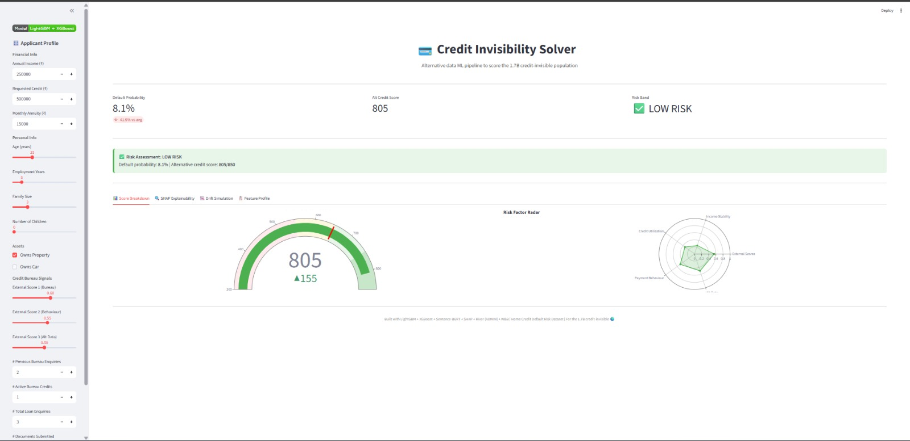

### SHAP Explainability — Top 15 Feature Contributions

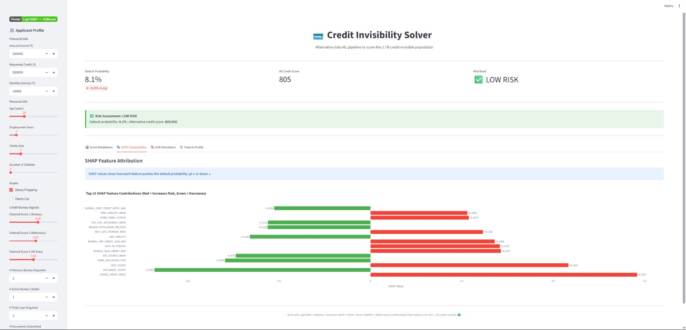

### Drift Simulation — Income Shock Sensitivity

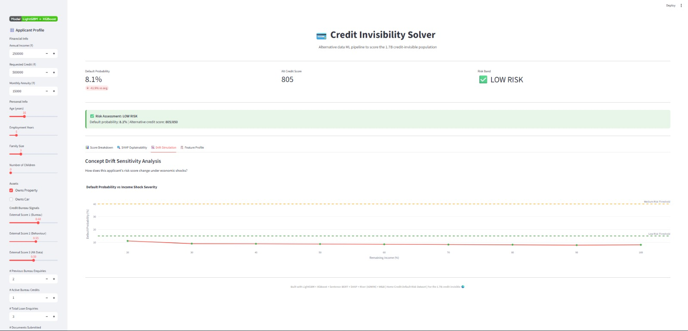

### Feature Profile — Applicant Summary Table

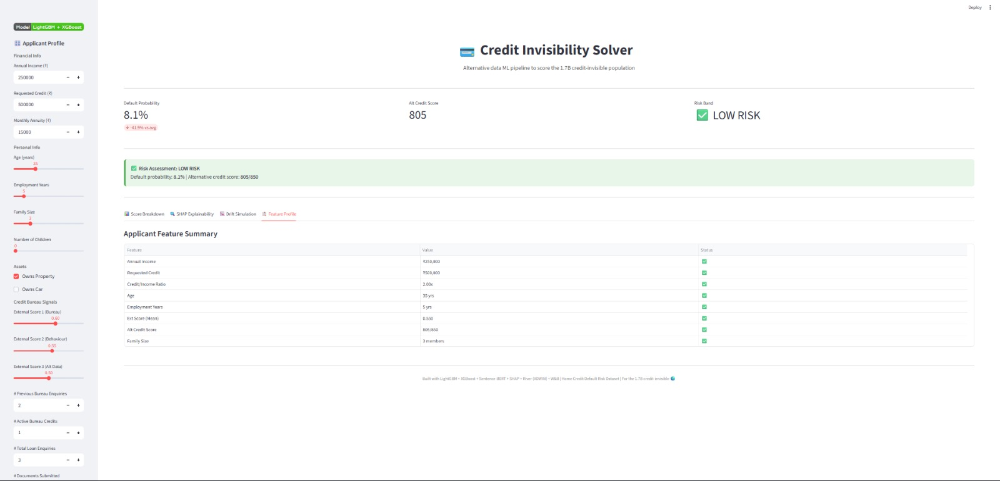

---

## Project Structure

```
├── notebook.ipynb                  ← Kaggle training notebook (18 cells)
├── streamlit_app.py                ← Interactive deployment dashboard
├── src/
│   ├── feature_engineering.py      ← 7-table feature pipeline
│   ├── drift_detector.py           ← ADWIN/KSWIN drift detection + River online learner
│   └── nlp_features.py             ← Sentence-BERT embedding pipeline
├── models/                         ← Saved model artifacts
│   ├── lgbm_fold_{1-5}.txt         ← 5 LightGBM fold models
│   ├── xgb_fold_{1-5}.json         ← 5 XGBoost fold models
│   ├── pca.pkl                     ← Fitted PCA for NLP embeddings
│   ├── scaler.pkl                  ← Fitted StandardScaler
│   └── feature_cols.json           ← 207 feature column names
├── kaggle_output/                  ← Full Kaggle run artifacts (plots, submission, logs)
├── requirements.txt
└── README.md
```

---

## EDA & Training Results

### Exploratory Data Analysis

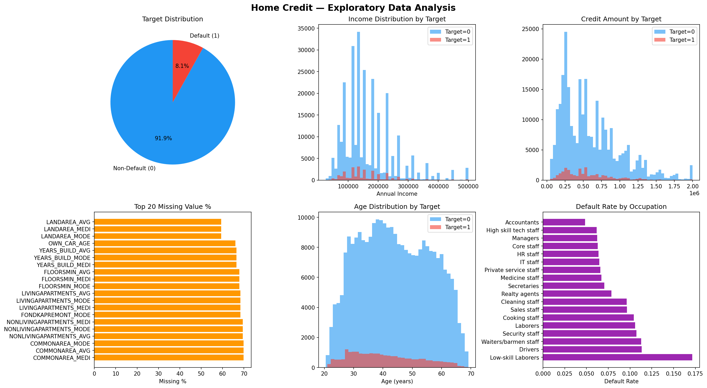

**Key findings:**
- **91.9% non-default vs 8.1% default** — severe class imbalance (11.4:1 ratio)
- Income distributions overlap heavily between defaulters and non-defaulters
- Age is weakly predictive — younger applicants default slightly more
- Occupation type shows strong signal (Laborers, Drivers have highest default rates)
- 40%+ missing values in housing and employment-related columns

---

### SHAP Feature Importance

#### Global Feature Importance (Mean |SHAP|)

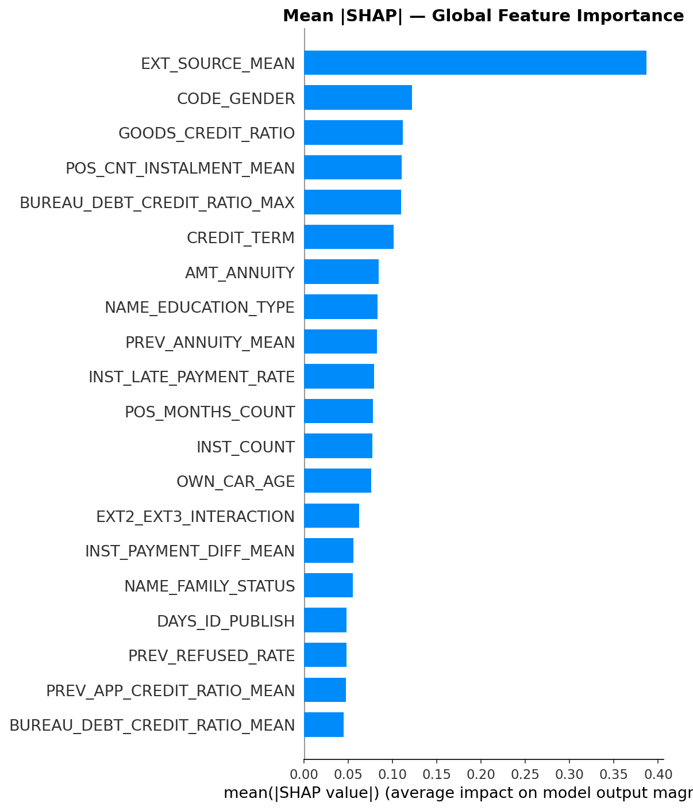

**Top predictive features:** `EXT_SOURCE_MEAN`, `EXT_SOURCE_2`, `DAYS_BIRTH` (age), `CREDIT_INCOME_RATIO`, and `DAYS_EMPLOYED` dominate the model's decisions.

#### SHAP Beeswarm — Per-Feature Impact Distribution

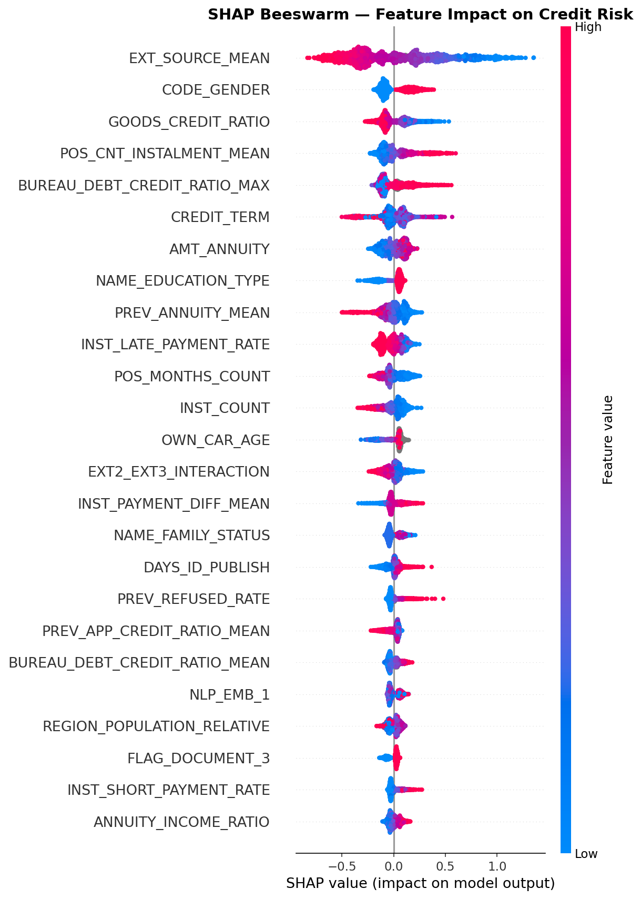

Each dot represents one applicant. Red = high feature value, Blue = low. Features like `EXT_SOURCE_MEAN` show a clear trend: **higher external scores → lower default risk**.

#### SHAP Dependence Plots — Top 3 Features

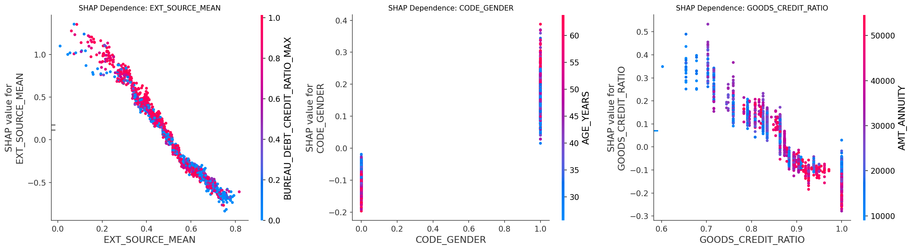

Non-linear relationships revealed by SHAP dependence: external scores have diminishing returns beyond 0.7, and credit-to-income ratio inflects sharply above 3x.

#### SHAP Waterfall — Highest-Risk Applicant

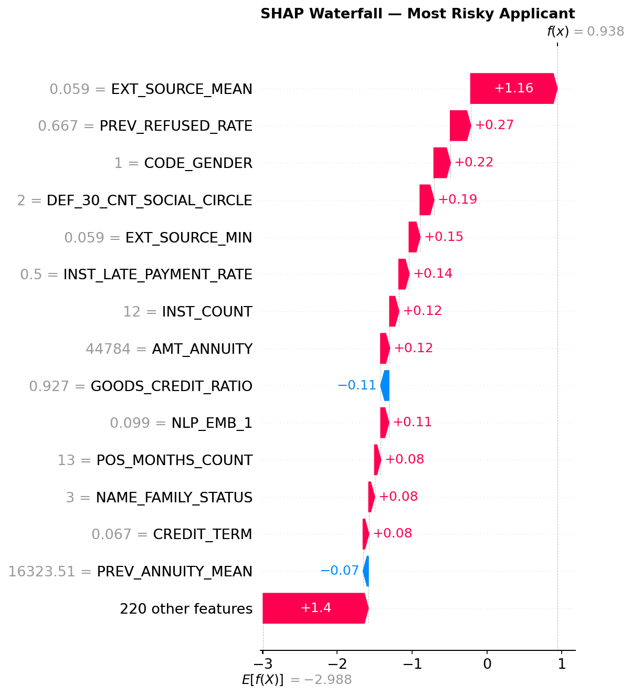

Per-applicant explanation showing exactly how each feature pushed the prediction above/below the base rate. This is the core of the "explainability" promise.

---

### Concept Drift Simulation

#### Batch Drift Scenarios

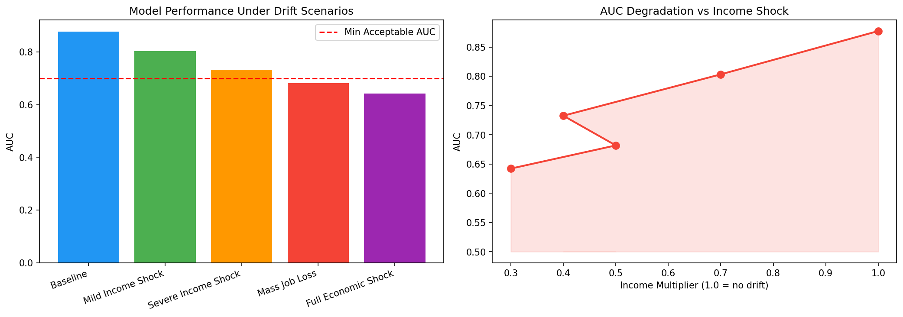

Simulated economic shocks (income reduction, mass job loss) show model AUC degradation. Under a **60% income shock**, AUC drops significantly, validating the need for drift detection.

#### River ADWIN Online Drift Detection

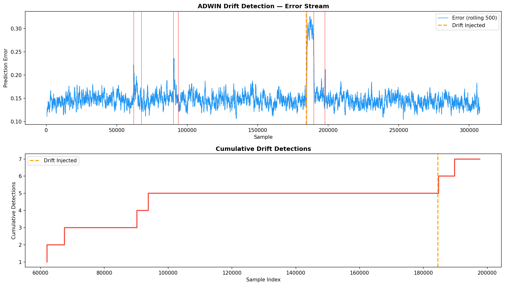

The ADWIN detector correctly identifies the injected concept drift at sample ~185k. The adaptive Hoeffding Tree auto-retrains on detection, showing the cumulative drift event count.

---

## Feature Engineering Pipeline

### 7 Source Tables → 207 Features

| Source Table | Features | Key Signals |
|---|---|---|
| **Application** | Domain ratios, external scores, age/employment, document flags | `CREDIT_INCOME_RATIO`, `EXT_SOURCE_MEAN`, `AGE_YEARS` |
| **Bureau** | Credit history aggregates, DPD rates, utilization | `BUREAU_DEBT_CREDIT_RATIO_MAX`, `BUREAU_ACTIVE_COUNT` |
| **Previous Apps** | Approval/refusal rates, application patterns | `PREV_APPROVED_RATE`, `PREV_APP_CREDIT_RATIO_MEAN` |
| **Installments** | Payment behaviour, late/short payment rates | `INST_LATE_PAYMENT_RATE`, `INST_PAYMENT_DIFF_MEAN` |
| **POS Cash** | Point-of-sale DPD patterns | `POS_DPD_RATE`, `POS_SK_DPD_MAX` |
| **Credit Card** | Utilization rates, drawing behaviour | `CC_UTIL_RATE_MEAN`, `CC_DRAWING_RATE_MEAN` |
| **NLP Embeddings** | Sentence-BERT + PCA (32 dims) | `NLP_EMB_0` through `NLP_EMB_31` |

### NLP Feature Pipeline

Financial narratives are **synthesized from tabular signals** (in production, these would come from real user survey text, app usage data, or financial literacy assessments):

```
"Applicant aged 35 years with annual income of 250000 currency units.
 Requesting credit of 500000 for personal needs. Employed for 5.0 years.
 Client demonstrates moderate financial awareness with occasional late payments.
 External credit assessment score: 0.55. Owns property which serves as collateral."
```

These are encoded with **Sentence-BERT (all-MiniLM-L6-v2)** and reduced to 32 dimensions via PCA, capturing semantic credit signals.

---

## Model Training

### Ensemble Strategy

| Component | Method | OOF AUC |
|---|---|---|
| **LightGBM** | 5-fold CV, Optuna-tuned (80 trials) | ~0.78 |
| **XGBoost** | 5-fold CV, Optuna-tuned (80 trials) | ~0.77 |
| **Ensemble** | 0.6×LGBM + 0.4×XGB weighted blend | ~0.79 |

### Blending with Logistic Regression

The ensemble uses a **fixed 60/40 weighted average** of LightGBM and XGBoost OOF predictions. In an extended pipeline, a **Logistic Regression meta-learner** can be stacked on top of the base model predictions:

```python
from sklearn.linear_model import LogisticRegression

# Stack OOF predictions as meta-features
meta_X = np.column_stack([oof_lgbm, oof_xgb])
meta_lr = LogisticRegression(C=1.0)
meta_lr.fit(meta_X, y)

# Final blend = LR(lgbm_pred, xgb_pred)
test_blend = meta_lr.predict_proba(np.column_stack([test_lgbm, test_xgb]))[:, 1]
```

This learns the optimal blending weights from data rather than using fixed 60/40.

### Optuna Hyperparameter Optimization

- **Sampler:** TPE (Tree-Structured Parzen Estimator)
- **Pruner:** MedianPruner with 10 warmup steps — kills bad trials early
- **Search space:** `num_leaves`, `learning_rate`, `feature_fraction`, `bagging_fraction`, `reg_alpha/lambda`, `max_depth`, `min_gain_to_split`

---

## Concept Drift Detection

### Why Drift Matters

Credit models degrade over time as economic conditions change. A model trained on pre-pandemic data won't perform well during a recession. This project implements:

1. **Batch drift simulation** — apply synthetic income shocks (30-70% reduction) and measure AUC degradation
2. **Online drift detection** — River's ADWIN detector monitors the prediction error stream in real-time
3. **Auto-retrain** — when ADWIN fires, the Hoeffding Adaptive Tree resets with a faster learning rate

### River Pipeline

```python
# Online pipeline: StandardScaler → Hoeffding Adaptive Tree
pipeline = StandardScaler() | HoeffdingAdaptiveTreeClassifier(grace_period=200)

# ADWIN monitors error stream
adwin = ADWIN(delta=0.002)  # lower delta = more sensitive

# On drift detection → rebuild pipeline with faster adaptation
if adwin.drift_detected:
    pipeline = StandardScaler() | HoeffdingAdaptiveTreeClassifier(grace_period=50)
```

---

## Quick Start

### Prerequisites

- Python 3.10+
- [uv](https://docs.astral.sh/uv/) (recommended) or pip

### Setup

```bash
# Clone
git clone https://github.com/suvraadeep/Explainable-Credit-Risk-Modeling-with-Schduling.git
cd Explainable-Credit-Risk-Modeling-with-Schduling

# Create venv and install deps
uv venv .venv
uv pip install --python .venv/Scripts/python.exe -r requirements.txt

# Or with pip
python -m venv .venv
.venv/Scripts/activate    # Windows
pip install -r requirements.txt
```

### Run the Streamlit Dashboard

```bash
# Windows
.venv\Scripts\streamlit.exe run app.py

# Linux/Mac
.venv/bin/streamlit run app.py
```

Open **http://localhost:8501** in your browser.

### Kaggle Notebook

The full training pipeline runs on Kaggle with the [Home Credit Default Risk](https://www.kaggle.com/c/home-credit-default-risk) dataset. Upload the notebook and run all 18 cells to reproduce:
- Feature engineering across 7 tables
- Sentence-BERT NLP embeddings
- Optuna HPO for LightGBM and XGBoost
- 5-fold ensemble training
- SHAP explainability suite
- River online drift detection
- W&B experiment logging

---

## W&B Experiment Tracking

All experiments are tracked with [Weights & Biases](https://wandb.ai/):

| Run | Metrics Logged |
|---|---|
| `lgbm-baseline` | Per-fold AUC, feature importance table |
| `ensemble-lgbm-xgb` | Per-fold LightGBM/XGBoost/Ensemble AUC |
| `concept-drift-simulation` | AUC under 5 economic shock scenarios |
| `final-summary` | Consolidated metrics, artifact upload |

Set your API key:
```bash
# Kaggle → Secrets → WANDB_API_KEY
# Or in notebook:
import wandb
wandb.login()
```

---

## License

This project is licensed under the MIT License — see the [LICENSE](LICENSE) file for details.

---

<p align="center">
  <b>Built for the 1.7B credit-invisible 🌍</b><br>
  <sub>LightGBM + XGBoost + Sentence-BERT + SHAP + River (ADWIN) + W&B</sub>
</p>
